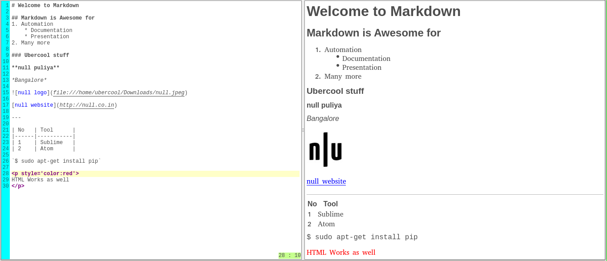

### Welcome to Automating Documentation, Presentation, Knowledge base using Markdown (Zero to Hero)

#### **null puliya** by ***Madhu Akula***

11th Feb 2017


## About Me !
- Automation Ninja at [Appsecco](http://appsecco.com)
- Fusion of Security, DevOps and Cloud
- Speaker & Trainer at Defcon, All Day DevOps, DevSecCon, etc
- Found bugs in Google, Microsoft, Yahoo, etc
- Never ending learner
- Follow (or) Tweet to me [@madhuakula](https://twitter.com/madhuakula)


## What you are going learn?
- Basics of Markdown and how to version control
- Automating Documentation, Presentation, Knowledgebase using Markdown
- Lot of exercises & tools
- Tips & Tricks to use in automated work flow


## Pre-requisites
- Anyone interested in automating their work flows using `Markdown`
- If you want practice along, Laptop with admin privilege required
- VirtualBox 5 (or) above
- Minimum 2GB RAM & 10GB Disk space


## Import virtual machine appliance
- Please import the virtual machine appliance from `null-puliya-adpk/automated-markdown.ova`

*images need to insert here*


## Start the virtual machine & Login

```
Username: ubercool
Password: forgot
```


## Local documentation for reference


## Zeal Application
- [Zeal](https://zealdocs.org/) is an off-line documentation browser. Very useful!
- MAC Alternative is [Dash](https://kapeli.com/dash)
- To open Zeal application, click on `Applications` and type `Zeal`


## What is Markdown?
> Markdown is a lightweight markup language with plain text formatting syntax designed so that it can be converted to HTML and many other formats. 
> - https://en.wikipedia.org/wiki/Markdown

[Read more about here](https://daringfireball.net/projects/markdown/)


## Powers of Markdown
- Plain Text
- Easy to read and write
- We can version control everything
- Generate awesome things (PDF, HTML, etc)

## Markdown Cheat Sheet

- Get here [http://packetlife.net/media/library/16/Markdown.pdf](http://packetlife.net/media/library/16/Markdown.pdf)
- Open offline copy at `Documents/markdown-cheat-sheet.pdf`
- To know more about syntax [https://daringfireball.net/projects/markdown/syntax](https://daringfireball.net/projects/markdown/syntax)


## Open Markdown Editor (ReText) and Follow below




## Exercise-1


- Hint: Image can found here `home/ubercool/Downloads/xss.png`


## Exercise-1 Solution

````
# Pentesting Report

## Cross Site Scripting Vulnerability (XSS)

### Vulnerable System

The application *search field* is vulnerable to cross site scripting vulnerability aka **XSS**

### Overview
Cross-Site Scripting (XSS) attacks are a type of injection, in which malicious scripts are injected into otherwise benign and trusted web sites.

### Proof of Concept
- Login to the port and navigate to the [http://localhost/search.php](http://localhost/search.php)
- Insert the below payload and click on search button

```
<script>alert(1)</script>
```

- Then you can see the alert box.
- Please find the below sample output screen shot for reference


### Solution

- [Reference for more details can found here](https://www.owasp.org/index.php/XSS_(Cross_Site_Scripting)_Prevention_Cheat_Sheet)
````


## Version Control
> Version control also known as revision control or source control, is a system that records changes to a file or set of files over time so that you can recall specific versions later.

- One of the popular version controlling software is `Git`


## Why version control
- Collaboration
- Helps to understand what happened
- Storing & Restoring Versions
- Backup
- Many more


## Git Basics
> Git is a version control system (VCS) for tracking changes in computer files and coordinating work on those files among multiple people. It can be used to keep track of changes in any files.

> I highly recommend playing this game to learn more about git [https://try.github.io](https://try.github.io)

Note: Git allows groups of people to work on the same documents at the same time, and without stepping on each other's toes. It's a distributed version control system.


## Follow these basic commands

- Create new directory 
```
$ mkdir puliya
$ cd puliya
```


## Git basics
- To initialize a Git repository
```
$ git init
```

- Create a text file with sample content

```
$ echo "git is awesome" > test.txt
```

- Then check the status of the repository

```
$ git status
```

- Add the file to version control

```
$ git add test.txt
```


## Git basics [contd.]
- Check the status

```
$ git status
```


- Commit the changes to the repository

```
$ git commit -m "added initial test.txt file"
```

- Check the status once again

```
$ git status
```


## Git basics [contd.]

- Add different data into `test.txt` file

```
$ echo "this is different content" > test.txt
$ git status
$ git add test.txt
$ git status
$ git commit -m "updated test.txt file with random content"
$ git status
```


## Git basics [contd.]
- Now let's browse them to see what we changed.

```
$ git log
```

- Add little more content
```
$ echo "this is different content from previous" > test.txt
```

- Look at the differences
```
$ git diff
```


## Git basics [contd.] (Not required here)
- To push to remote repository from local, add the remote repository
```
$ git remote add origin https://github.com/username/reponame.git
```

- Push the changes to remote repository

```
$ git push -u origin master
```

- To pull the changes

```
$ git pull origin master
```


## Git basics [contd.] (Not required here)
- To clone a git repository
```
$ git clone https://github.com/madhuakula/null-puliya-adpk-markdown.git
```

- Check this out for more reference [http://rogerdudler.github.io/git-guide/](http://rogerdudler.github.io/git-guide/)


## 